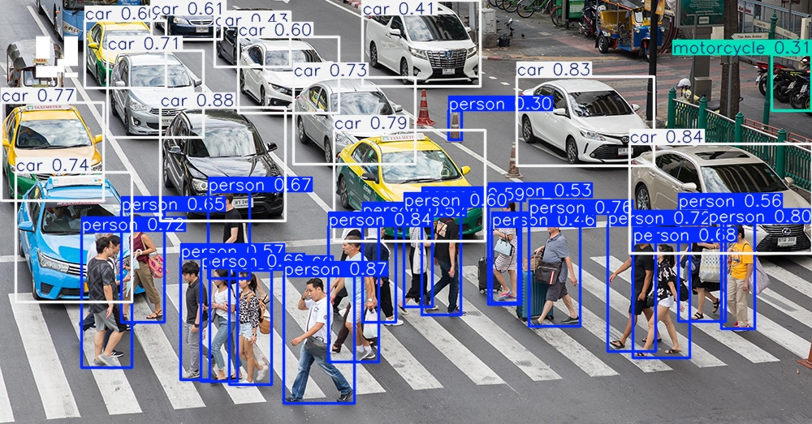

# object_detection_edge_compute_on_jetson_nano_2GB
This project made for object detection on while driving that means we do not need to
use all the class from coco dataset in normally while driving we see around 5 class is
person bicycle car motorcycle bus after train model I deploy it on jetson nano by using 
.onnx format and convert to .engine(tensorrt) to increase performance

# Setup jetson nano 2GB
I recommend 64GB of micro sd card

1.install os on jetson nano by using jetpack because jetpack aready have tensorrt tools and we don't need to install by this link https://developer.nvidia.com/embedded/jetpack-sdk-461 click jetson nano develop kits and selec for jetson nano 2GB if you don't use jetson nano 2GB click on Jetson Nano Developer Kit

2.format micro sd card

3.use balena etcher to install os

4.setup

# This section will do on your DESTOP
## please cd PC directory to do next step

# Before you run my code you must to download all the dataset that I use
1.COCO2017 dataset for retrain yolov8n model you can down load with this link
https://www.kaggle.com/datasets/awsaf49/coco-2017-dataset

2.VOC2012 dataset for benchmark model you can down load with this link
https://www.robots.ox.ac.uk/~vgg/projects/pascal/VOC/voc2012/

3.extrac both of file

# After download all the dataset you need to down load library
my python is version 3.12.10 the library is depend on your python and GPU(I use pythorch)
you can see the library on listlibrary.txt or use this command to install all
````
pip install -r list_library.txt
````
# Step to run file
This file will selec only 5 class we need

1.run file selec_class_txt.py

Why we need to split because good model should have 80% train and 20% valid but after selec class I have approximately 3000 compared to 70000, which is only about 4%

2.run file splitratio.py 

this code will train on your GPU but take a long period of time while train model depend on your GPU

3.run file train.py

if you need to run test you can run this command
source=0 is your camera you can type test.jpg test.mp4
````
yolo detect predict model=runs/detect/yolo8nretrain/weights/best.pt source=0 show=True device=0
````

the result should like this

# Benchmark
When the retrain model finished you can run is command to test or run benchmark.py file
you can change to pretrain model by type model=yolov8n.pt
````
yolo detect val model=runs/detect/yolo8nretrain/weights/best.pt data=voc_yolo/data.yaml
````
the data after benchmark will store on directory runs/detect/
interference mAP50 mAP50-95 Recall will show on your terminal 

# Convert to onnx
After satisfied with the results will convert to .onnx format after deploy to jetson nano 2GB run convert_pt_to_onnx.py file and move them to jetson nano in some way such as flash drive network file .onnx after convert will store on runs/detect/yolo8nretrain/weights/

# Next section do on jetson nano 2GB
I create directory on ~/object_detection to store all thing we do in this project
the tools we will is trtexec to convert .onnx to tensorrt(.engine)
````
/usr/src/tensorrt/bin/trtexec --onnx=modelonnxforjetson.onnx --saveEngine=model_retrain_fp16.engine
````
